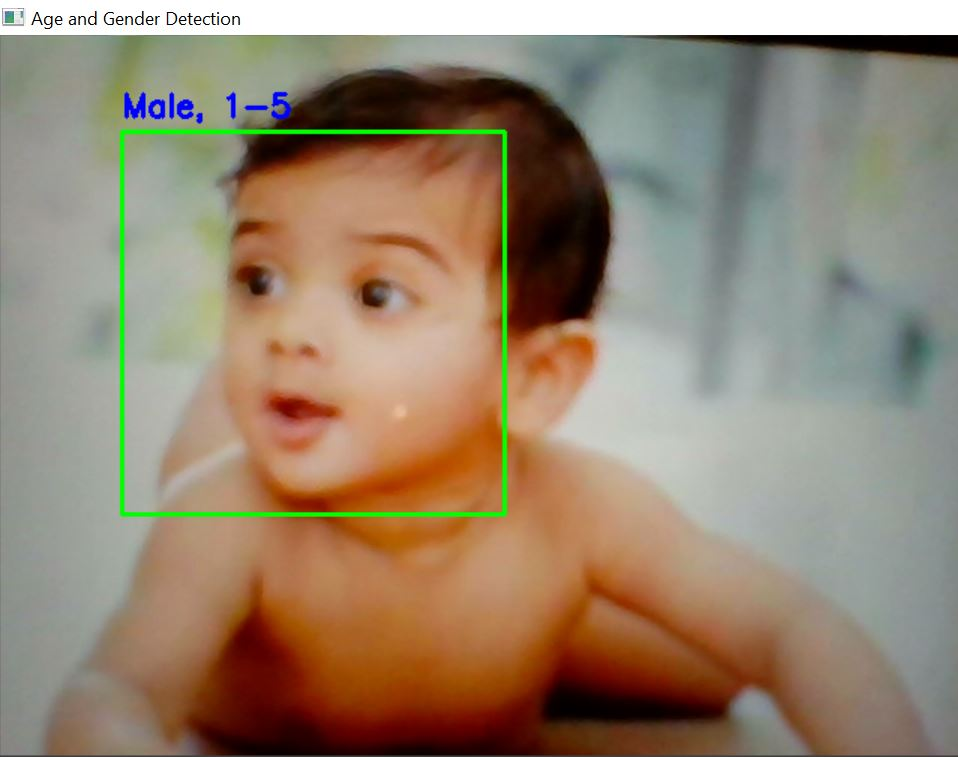
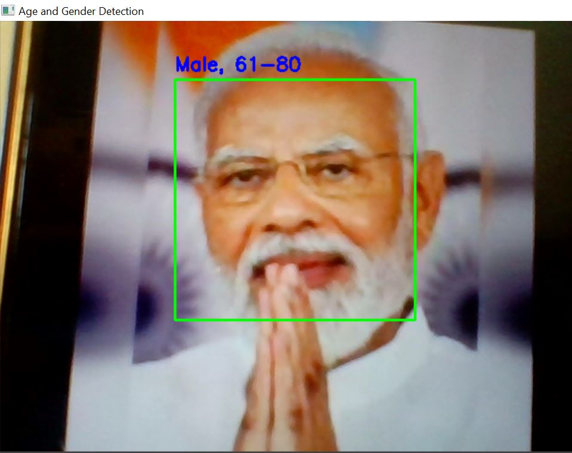
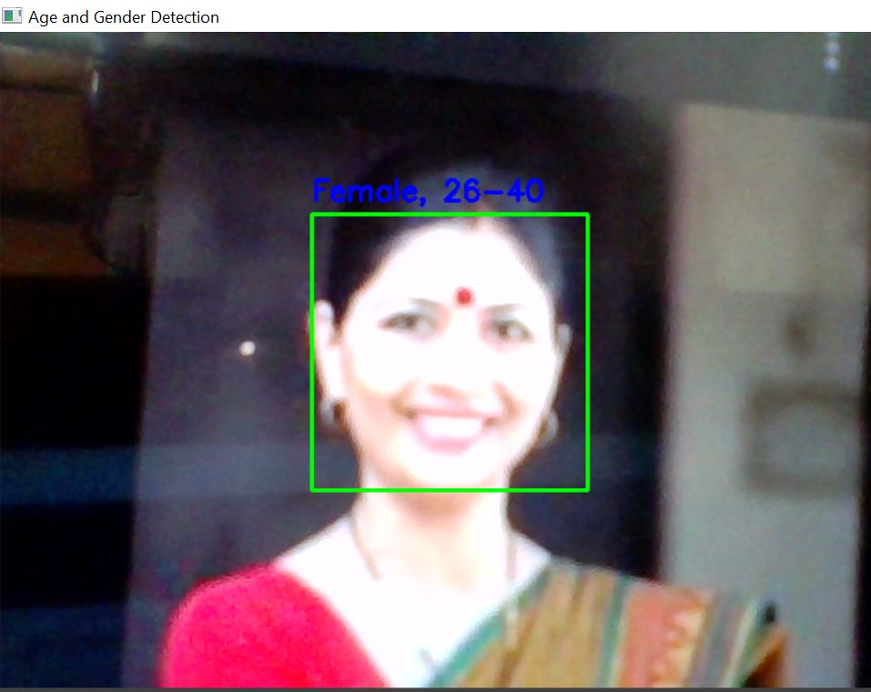
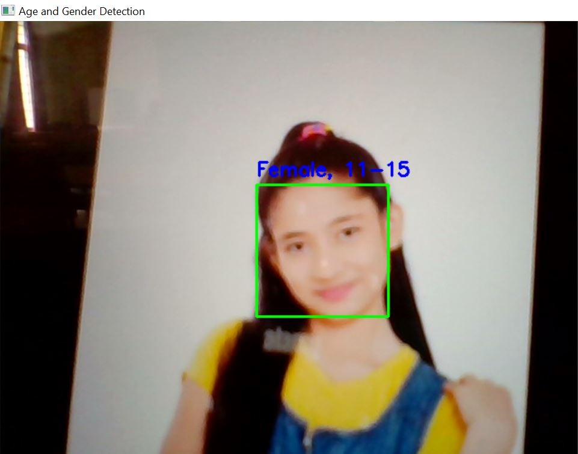

# 🧠 Real-Time Age and Gender Detection using OpenCV

This project uses **OpenCV** and **deep learning-based pre-trained models** to detect faces in a webcam feed and predict the **age range** and **gender** of the person in real-time.

---

## 📌 Project Overview

We use OpenCV’s DNN module and Haar cascade classifier to:

- Detect human faces in webcam video feed
- Predict **gender** (Male/Female)
- Predict **age group** (like 1–5, 6–10, ... 80–100)

### 🚀 How It Works

1. **Webcam feed** is read in real-time using `cv2.VideoCapture`.
2. Faces are detected using OpenCV's **Haar Cascade Classifier**.
3. Detected face regions are passed through:
   - **Gender Prediction Model** (`gender_net.caffemodel`)
   - **Age Prediction Model** (`age_net.caffemodel`)
4. Models output the predicted class with the **highest confidence score**.
5. The results are shown live on the video feed using OpenCV.

---

## 🧠 Pre-trained Models Used

These models are trained using **Caffe** framework and are loaded with `cv2.dnn.readNetFromCaffe()`:

- `age_net.caffemodel` (with `age_deploy.prototxt`)
  - Predicts age in 9 ranges like `'1-5', '6-10', ..., '80-100'`
- `gender_net.caffemodel` (with `gender_deploy.prototxt`)
  - Predicts `'Male'` or `'Female'`

We don’t train anything here, so **no dataset needed** — it’s **inference-only** using pre-trained models 🎯

---

## 📦 Installations & Setup

Run the following in your Colab or local `.ipynb` to install dependencies and download models:

```bash
# Install required packages
!pip install opencv-python-headless numpy

# Download models
!wget https://www.dropbox.com/scl/fi/eva2roklpqn0lh52mk5j2/Copy-age_net.caffemodel?rlkey=nt9d615zw0tupmqsrgit635y5&st=cdrdqk63&dl=1 -O age_net.caffemodel
!wget https://raw.githubusercontent.com/spmallick/learnopencv/master/AgeGender/age_deploy.prototxt -O age_deploy.prototxt

!wget https://www.dropbox.com/scl/fi/ynm8706p7mf1kvyj3ppf3/gender_net.caffemodel?rlkey=c4mjwtr4iuzpstwgeowr7tuk7&st=w4xpdcmf&dl=1 -O gender_net.caffemodel
!wget https://raw.githubusercontent.com/spmallick/learnopencv/master/AgeGender/gender_deploy.prototxt -O gender_deploy.prototxt

```

## 🚀 How to Run the Project

1. **Clone the repo** or download the `.ipynb` file to your system  
2. **Run all cells** in order from top to bottom  
3. Make sure **webcam access** is allowed (for local use)  
4. **Press 'A'** to quit the webcam window

##📸 Sample Output

<p align="center">
  
  
</p>
<p align="center">
  
  
</p>


## 🙌 Credits

- [OpenCV’s Age & Gender Detection Tutorial](https://github.com/spmallick/learnopencv/tree/master/AgeGender)
- [Caffe Model Zoo – Pre-trained Models](https://github.com/BVLC/caffe/wiki/Model-Zoo)
